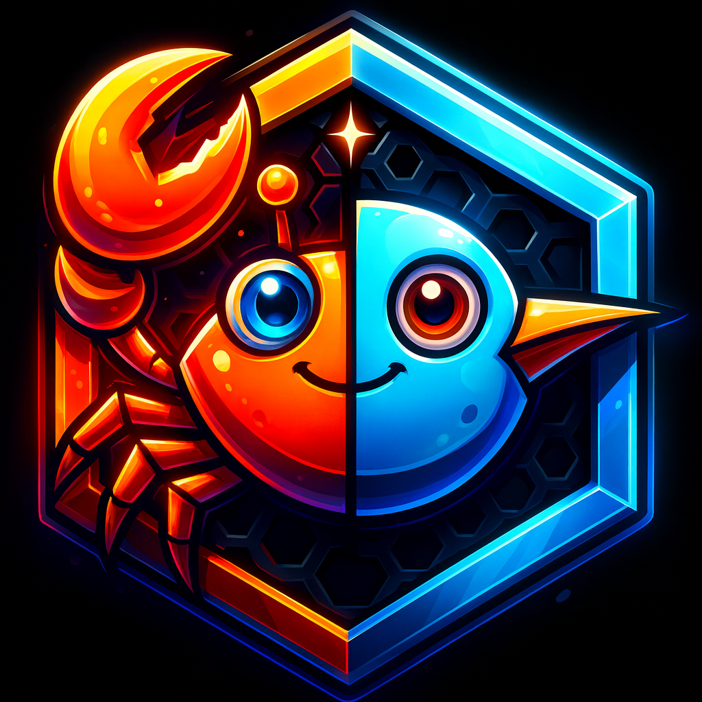

  

# Portalis

Welcome to **Portalis**! Portalis is a cross-platform framework integrating the high-performance capabilities of **Rust** with the cross-platforms UI features of **Flutter**. Designed for efficiency and scalability, Portalis aims to leverage the best of both technologies for building robust applications.

## Documentation

For detailed setup instructions and more, please refer to the documentation:

- [Setup Guide](doc/setup_guide.md)

## Features

- **Cross-Platform Support**: Runs on Android, iOS, desktop and web environments.
- **Rust-Powered Backend**: High-performance and memory-safe backend functionality.
- **Flutter UI**: Flexible and expressive user interface design with Flutter.

## Getting Started

To set up the development environment, follow the steps in the [Setup Guide](doc/setup_guide.md).

## License

This project is licensed under the MIT License. See the `LICENSE` file for details.

---

Happy coding!
